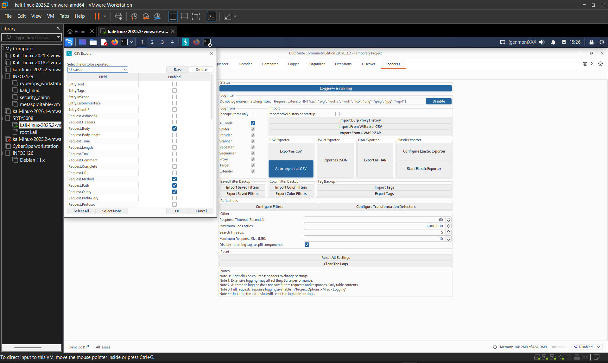
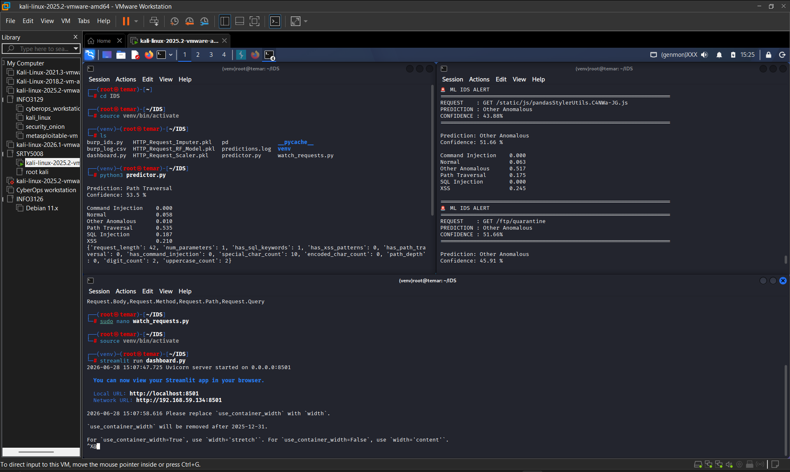
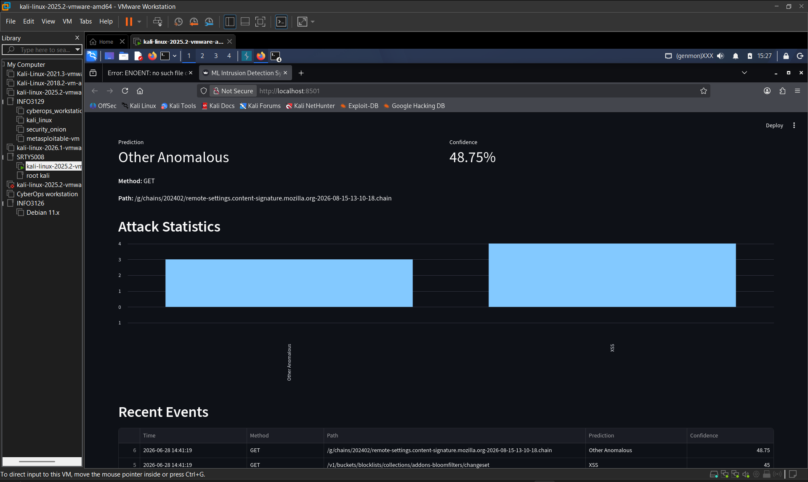

# ML HTTP Intrusion Detection System

A machine learning-powered intrusion detection system (IDS) that classifies HTTP requests in real-time using a Random Forest classifier. Built for **SRTY-5008 Web Security II** at Fanshawe College.

---

## Overview

This project implements a complete ML pipeline for detecting web application attacks from HTTP traffic:

| Component | Purpose |
|:---|:---|
| `predictor.py` | Feature extraction + ML prediction engine |
| `watch_requests.py` | File watcher that monitors Burp Suite CSV exports |
| `dashboard.py` | Real-time Streamlit dashboard for attack visualization |
| `burp_ids.py` | Burp Suite extension stub (Jython-compatible architecture) |

### Attack Classes Detected

- Command Injection
- Normal (benign traffic)
- Other Anomalous
- Path Traversal
- SQL Injection
- XSS (Cross-Site Scripting)

---

## Architecture

```
┌─────────────────┐     Auto-export CSV      ┌─────────────────┐
│  Burp Suite     │ ───────────────────────► │  watch_requests │
│  + Logger++     │                        │     .py         │
└─────────────────┘                        └────────┬────────┘
                                                    │
                                                    ▼
                                            ┌─────────────────┐
                                            │  predictions    │
                                            │     .log        │
                                            └────────┬────────┘
                                                     │
                                                     ▼
                                            ┌─────────────────┐
                                            │   dashboard     │
                                            │     .py         │
                                            │  (Streamlit UI) │
                                            └─────────────────┘
```

1. **Burp Suite** captures HTTP traffic via Logger++
2. **Logger++** auto-exports to `burp_log.csv`
3. **`watch_requests.py`** polls the CSV, extracts features, runs ML inference
4. **`predictions.log`** stores results in append-only format
5. **`dashboard.py`** renders live statistics via Streamlit

---

## Requirements

- Python 3.10+
- Burp Suite Community Edition (with Logger++ extension)
- Kali Linux 2025.2 (tested environment)

### Python Dependencies

```bash
pip install pandas numpy scikit-learn joblib streamlit
```

> **Note:** The model files were trained with scikit-learn 1.6.1. If you encounter `InconsistentVersionWarning` or `AttributeError` on `_fill_dtype`, downgrade:
> ```bash
> pip install scikit-learn==1.6.1 --force-reinstall
> ```

---

## Setup

### 1. Clone & Enter Directory

```bash
cd ~/IDS
```

### 2. Create Virtual Environment (Kali 2025.2 Required)

Kali uses an externally-managed Python environment. Use a venv:

```bash
python3 -m venv venv
source venv/bin/activate
pip install pandas numpy scikit-learn==1.6.1 joblib streamlit
```

### 3. Verify Model Files

Ensure these files are in your working directory:

| File | Purpose |
|:---|:---|
| `HTTP_Request_RF_Model.pkl` | Trained Random Forest |
| `HTTP_Request_Imputer.pkl` | Missing value imputer |
| `HTTP_Request_Scaler.pkl` | StandardScaler |

### 4. Configure Burp Suite Logger++

1. Open **Burp Suite → Extender → BApp Store → Install Logger++**
2. Go to the **Logger++** tab → **Options**
3. Under **CSV Exporter**, select fields in this exact order:

   

   - `Request.Body`
   - `Request.Method`
   - `Request.Path`
   - `Request.Query`

4. Click **Auto-export as CSV** and set the path to your `~/IDS/burp_log.csv`

> **Important:** `Request.Body` must be **last** in the column order. Logger++ omits empty leading fields, which shifts CSV columns left if Body is not last.

---

## Usage

### Terminal 1: Start the ML Watcher

```bash
cd ~/IDS
source venv/bin/activate
python3 watch_requests.py
```

The watcher polls `burp_log.csv` every second, runs predictions on new rows, and prints alerts:

```
ML IDS ALERT
REQUEST  : GET /index.php?id=1' OR 1=1--
PREDICTION: SQL Injection
CONFIDENCE: 94.50%
```

You should see live output like this in your terminal:



### Terminal 2: Start the Dashboard

```bash
cd ~/IDS
source venv/bin/activate
streamlit run dashboard.py
```

Open your browser to:

- **Local:** http://localhost:8501
- **Network:** http://<your-kali-ip>:8501

The dashboard displays live attack statistics and recent events:



The dashboard shows:
- **Latest Event** — most recent prediction with confidence
- **Attack Statistics** — bar chart of attack type frequencies
- **Recent Events** — scrollable history table

---

## File Reference

| File | Description |
|:---|:---|
| `predictor.py` | Core ML engine. Loads model, extracts 11 features from raw HTTP, returns prediction + confidence |
| `watch_requests.py` | CSV watcher with robust parser that pads missing empty fields from Logger++ exports |
| `dashboard.py` | Streamlit web UI that reads `predictions.log` and renders live charts |
| `burp_ids.py` | Burp extension stub (Jython-compatible). Note: Direct scikit-learn import fails under Jython; use the file-watcher pipeline instead |
| `predictions.log` | Append-only log output. Format: `timestamp,method,path,attack_name,confidence` |

---

## Feature Extraction

The model uses 11 engineered features from raw HTTP requests:

| Feature | Description |
|:---|:---|
| `request_length` | Total character count |
| `num_parameters` | Count of `=` characters |
| `has_sql_keywords` | Binary: SQL keywords detected (select, union, drop, etc.) |
| `has_xss_patterns` | Binary: XSS patterns detected (`<script>`, `javascript:`, etc.) |
| `has_path_traversal` | Binary: `../` sequence found |
| `has_command_injection` | Binary: `;`, `\|`, `&&` found |
| `special_char_count` | Count of `<>'";=&\|` |
| `encoded_char_count` | Count of `%` (URL-encoded characters) |
| `path_depth` | Count of `/` characters |
| `digit_count` | Count of numeric digits |
| `uppercase_count` | Count of uppercase letters |

---

## Troubleshooting

| Issue | Solution |
|:---|:---|
| `externally-managed-environment` | Create and use a Python venv (see Setup step 2) |
| `AttributeError: 'SimpleImputer' object has no attribute '_fill_dtype'` | Downgrade scikit-learn: `pip install scikit-learn==1.6.1 --force-reinstall` |
| CSV columns shifted / wrong method/path values | Ensure Logger++ exports with `Request.Body` **last** in column order |
| Dashboard shows "No events yet" | Verify `predictions.log` exists and `watch_requests.py` is running |
| Burp extension fails to load | Jython cannot import C-extension libraries (numpy, sklearn). Use the file-watcher pipeline |

---

## Model Training

The Random Forest classifier was trained on `final_multiclass_http_attack_dataset_v2.csv` with the following pipeline:

1. **Data Cleaning** — strip spaces, remove duplicates, handle infinity/NaN
2. **Train/Test Split** — 80/20 stratified split
3. **Imputation** — median strategy for missing values
4. **SMOTE** — synthetic oversampling for class balance
5. **StandardScaler** — feature normalization
6. **GridSearchCV** — hyperparameter tuning (`n_estimators`, `max_depth`, `min_samples_split`)
7. **Evaluation** — weighted F1-score, confusion matrix, feature importance analysis

Training notebook: `srty3009_a1__http_request_classification_random_forest.py`

---

## Authors

- Alicia Lancaster (1295404)
- Temar Lewis (1286410)

**Course:** SRTY-5008 Web Security II — Fanshawe College

## License

Academic project for educational purposes.
